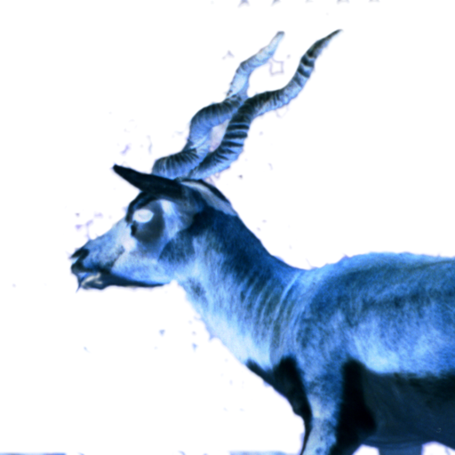

## 24 bit BMP to Negative

Simple haskell script that creates a negative of a given `.bmp` file. Supported `.bmp` is limited to

1. 24 bpp pixel size
2. Uncompressed

||original|negative|
|-|-|-|
|blackbuck|||
|marbles|||
|bmp_24|||


## Executable Guide
* Install the executable using
  ```cabal install```
* Run the exectuable using
  ```bmp-negative {PATH_TO_BMP_IMAGE}```
  * `-h` flag for help message
* Image will be generated in the same directory as the original image.

## How it Works
* Script imports the `.bmp` image as a `ByteString` and converts is to a `[Byte]` or byte array.
* Split the byte array as `(Header,PixelData)`. 
  * Initially, the header data is parsed. Check whether application accepts the given `.bmp`.
  * Parse the `PixelData`.
    * We can consider it as an array of `Row`s.
    * Each `Row` is a byte array of `RGB` color bytes and `Padding` bytes.
    * The number of `Padding` bytes is `rowSize - 3 * width`, where `rowSize = div (width * 24 + 31) 32 * 4`
  * Relevent type alias' here:
    ```
    type BmpImage   = (Header,PixelData)
    type Header     = [Byte]
    type PixelData  = [Row]
    type Row        = (RGB,Padding)
    type RGB        = [Byte]
    type Padding    = [Byte]
    ```
* Negate the image. It's a simple operation of `255 - b`, where `b` is an RGB color byte.
* Write the new `BmpImage` as a new `.bmp`.

## Thoughts
* Needs better more robuts Error handling
* Needs more exhaustive tests